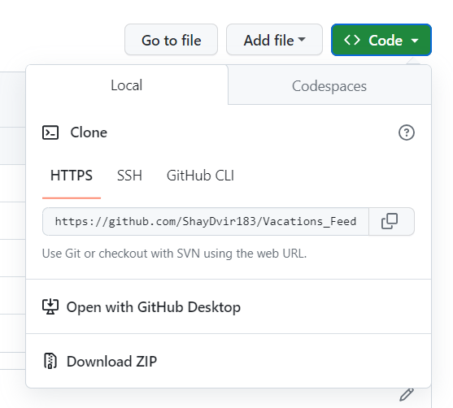

<h1 style="color: #8abaea;"> Welcome To Pooking</h1>

<h2 > Introduction</h2>

Welcome To Pooking, Pooking is a comprehensive project designed to assist individuals in obtaining information about vacations and efficiently managing their travel plans. This system aims to simplify the process of gathering essential details about various vacation destinations, tracking important dates, managing expenses, and understands what are the vacations that other people desire.

<h2 style="color: #8abaea;">Table of Contents</h2>
<ul>
<li>Technologies Used</li>
<li>Installation</li>
</ul>

<h2 style="color: #8abaea;">Technologies Used</h2>
<h5>This project utilizes the following technologies:</h5>
<ul>
<li>Frontend Development:</li>

The frontend development of this project is built using React, a popular JavaScript library for building user interfaces. React provides a powerful and efficient way to create interactive and dynamic UI components, ensuring a smooth and seamless user experience.

<li>Backend Development:</li>

The backend of this project is developed using Node.js along with the Express framework. Node.js enables server-side JavaScript execution, allowing for efficient and scalable backend development. Express, a minimal and flexible web application framework for Node.js, simplifies the development of robust APIs and server-side logic.

<li>HTML and CSS:</li>

 The project incorporates HTML (Hypertext Markup Language) and CSS (Cascading Style Sheets) for structuring and styling the web pages. HTML is used to define the structure and content of the application, while CSS is employed to enhance the visual presentation, layout, and styling of the HTML elements.

<li>Database:</li>

This project utilizes the MySQL relational database management system. MySQL is a widely-used open-source database that provides scalability, performance, and reliability for storing and retrieving data. It allows for efficient management of structured data and enables seamless integration with the backend of the application.

</ul>

 <h2 style="color: #8abaea;">Installation</h2>

 Clone This Git Folder 

<h3> Create New Folder </h3>

<h5>Open Command Line Inside Your New Folder :</h5>

     git init

     git clone https://github.com/ShayDvir183/Vacations_Feed.git

<h4>Now You Have Pooking On Your Device</h4>

<h3>Now we Need To Install All The Npm Packages</h3>

<h4 style="color:#8abaea"> Lets Start With Server Side</h4>

    cd ./backend

    npm i

<h4 style="color:#8abaea;">Lets Move To Client Side</h4>

     cd ..

    cd ./vacations-client

    npm i

<h3> Server Side & Client Side Are Ready , Lets Set The DATABASE</h3>

<h2 style="color: #8abaea;"> Docker</h2>

 We Want Your Experience To Be The Best So We Need You To Install Docker Desktop

<h2 style="color: #8abaea;">Docker Site</h2>  <a>https://www.docker.com/products/docker-desktop/</a>

<h4>So You Have Docker Desktop Installed Lets Get To Business</h4>

 
We Left Our Command Line On Client Folder - Lets Get Inside dev-apps folder

    cd ..
    cd ./dev-apps
    docker-compose up

 So We Got The DataBase Ready & All The Npm Packages Installed Lets Open New Terminal

    cd ./backend
    npm run start

 In A Few Seconds The Website Will Open

Enjoy

<h3 style="color: red;">For Best User Experience -  Admin User-Name Is : shayd  
Password Is : 1 </h3>
